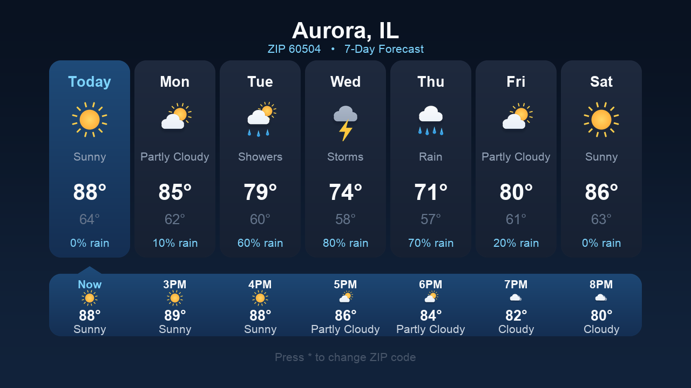

# Weather for Roku

A simple, modern 7-day weather app for Roku. Enter a US ZIP code once and the
app remembers it, showing a clean daily forecast every time you open it.



## Features

- **7-day forecast** with daily highs, lows, conditions, and chance of rain.
- **Enter your ZIP once** — it's saved locally and reused on every launch.
- **Change location anytime** by pressing `*` on the remote.
- **On-device ZIP lookup** — no geocoding service is contacted.
- **Beautiful, minimal UI** with custom weather art for each condition.

## Data sources

- **Forecast:** [U.S. National Weather Service API](https://www.weather.gov/documentation/services-web-api)
  (`api.weather.gov`) — public domain, free for any use.
- **ZIP → coordinates:** bundled [U.S. Census ZCTA Gazetteer](https://www.census.gov/geographies/reference-files/time-series/geo/gazetteer-files.html)
  (public domain), compiled into `data/zips.dat` for fast on-device lookup.

No accounts, no tracking, no analytics.

- **Privacy Policy:** https://acosmicwave.github.io/weather-for-roku/privacy.html
- **Terms of Use:** https://acosmicwave.github.io/weather-for-roku/terms.html

## Project layout

```
manifest              Roku channel manifest (icons, splash, versions)
source/               App entry point (main.brs)
components/           SceneGraph UI + logic
  MainScene.*         Screen flow: ZIP entry, loading, forecast
  WeatherTask.*       ZIP lookup + NWS fetch (runs off the render thread)
  DayCard.*           A single day's forecast card
  NumPad.*            On-screen numeric keypad
data/zips.dat         Bundled ZIP -> lat/lon table (fixed-width, zip-sorted)
images/               Icons, splash, UI chrome, and weather art
tools/                Python asset generators (icons, marketing, ZIP data)
marketing/            Streaming Store poster + screenshots
```

## Build & sideload

Package the app into a zip:

```bash
rm -f weather.zip
zip -r weather.zip manifest source components images data
```

Then upload `weather.zip` via the Roku Development Application Installer at
`http://<your-roku-ip>` (enable Developer Mode on the device first).

## Regenerating assets

All image and data assets are reproducible with Python (requires `pillow`):

```bash
python3 tools/gen_icons.py      # app icons, splash, UI chrome, weather art
python3 tools/gen_zipdata.py    # rebuild data/zips.dat from the Census gazetteer
python3 tools/gen_marketing.py  # Streaming Store poster + screenshots
```

## Notes

- Coverage is the U.S. and its territories (NWS only).
- The `User-Agent` in `components/WeatherTask.brs` identifies the app to the NWS
  API (they use it to reach the maintainer if there's ever an issue).

## License

Licensed under the [PolyForm Noncommercial License 1.0.0](LICENSE). You are free
to use, modify, and share this project for any **noncommercial** purpose.
Commercial use is not permitted under this license.

## Contact

weatherforroku@gmail.com
